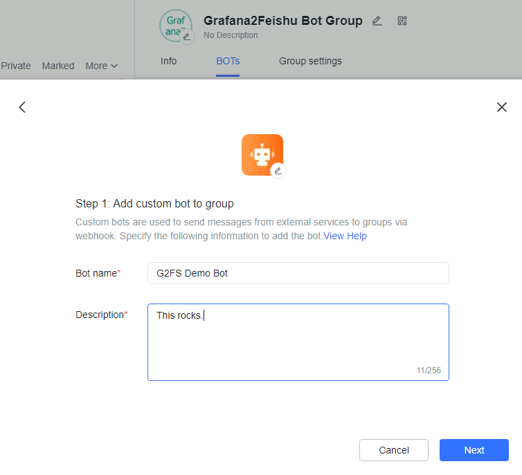
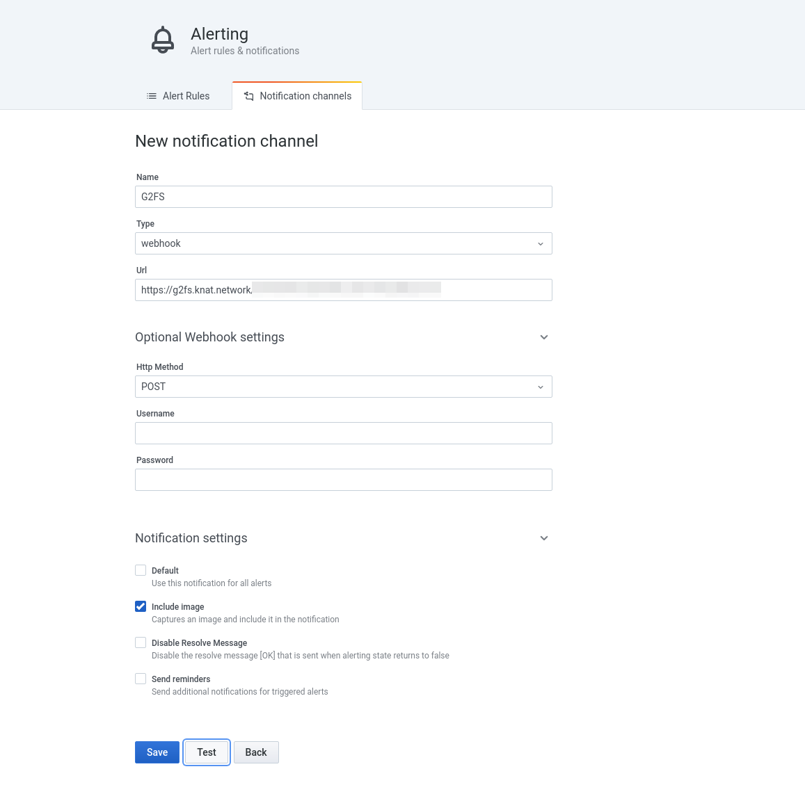
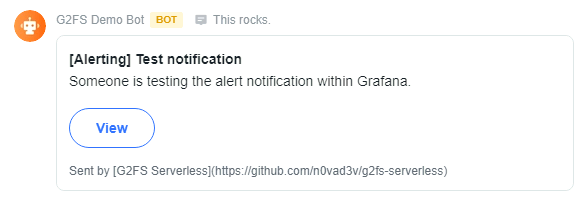

# G2FS (Grafana 2 Feishu(Lark)) Serverless Edition
> Proxy Grafana Webhook alert to Feishu/Lark.

Grafana doesn't support push alert to Feishu(Lark) by it's design, this is a small adapter for supporting this.

## Installation

Simple copy the content of `index.js` to Cloudflare Workers.

## Usage

### Create a Feishu Bot

Create a webhook bot with

For instance, the webhook address is `https://open.feishu.cn/open-apis/bot/v2/hook/e28dde4c-1998-0002-0018-114514114514`.

### Configure Grafana

In the configuration above, we need to specify the address like this:

`https://g2fs.knat.network/e28dde4c-1998-0002-0018-114514114514`

### Demo

Quite simple, isn't it?

## TODO

* [ ] Add Image Support